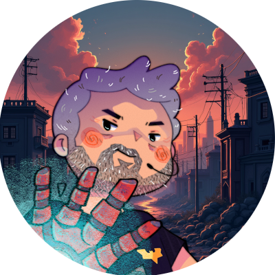

    Preview do Podcast

    <audio src="./src/output/podcast_edited.mp3" controls title="Podcast editado"></audio>

# Projeto Podcast Gerado por I.A.s

> ℹ️ **NOTE:** Este é o repositório desenvolvido durante o Bootcamp Microsoft 50 Anos - Prompts Inteligentes em parceria com a [DIO](https://dio.me)

Projeto com o objetivo de gerar um podcast utilizando ferramentas de IA através de prompts mais trabalhado.

Utilizei uma esteira de prompts para gerar cada etapa do processo criativo.

## 💻 Tecnologias utilizadas no projeto

- [ChatGPT](https://chat.openai.com/)
- [ElevenLabs](https://elevenlabs.io)
- [Capcut](https://www.capcut.com/pt-br/)

## ✨ Como foi feito ?

- Roteiro gerado via chatgpt
- Audio gerado pela elevenLabs
- Capcut para tratar aúdio e adicionar sons de fundo

---

⌨️ com 💜 por [Ademilson Almeida](https://github.com/ademilsonalmeida)
